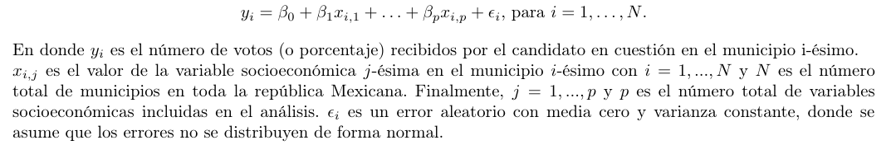

    # Analisis_elecciones_presidenciales_2018
    Por completar-en cosntruccion

    Objetivo del análisis

Este proyecto tiene como objetivo analizar la relación entre variables socioeconómicas provenientes del Censo de Población y Vivienda 2020 y el comportamiento electoral observado en la elección presidencial de 2018 en México.

El análisis se enfoca en identificar subconjuntos de variables socioeconómicas que presentan asociación con la intención de voto a favor de los candidatos presidenciales:

Andrés Manuel López Obrador (AMLO)

Ricardo Anaya Cortés (RAC)

El problema se aborda como un ejercicio de selección de variables independientes de forma separada para cada candidato, con el fin de caracterizar patrones diferenciados de comportamiento electoral a nivel municipal.

Los objetivos específicos del proyecto son:

Estimar intervalos de confianza para la intensidad (peso) de cada variable socioeconómica en la intención de voto, considerando de manera independiente los resultados para AMLO y RAC.

Identificar grupos de variables que:

Influyan únicamente en uno de los candidatos.

Influyan en ambos candidatos, pero con distinta magnitud.

Influyan de manera similar en ambos candidatos.

Para este propósito se emplea un modelo de regresión lineal múltiple, el cual permite evaluar asociaciones y cuantificar la magnitud de los efectos observados, es decir 
    

## Metodología
El proyecto esta dividido en partes: 

1.**Variables de respuesta**. 

Primero, se construyen los subtotales a nivel municipal para las variables de interés a partir de las bases de datos electorales disponibles. En particular, la variable y_i se define mediante la agregación de los [cómputos distritales](https://computos2018.ine.mx/#/descargaBase) hacia el nivel municipal. 

Posteriormente, se define un identificador único de municipio que permitirá vincular las distintas bases de datos. Todo este procedimiento se desarrolla en el script `Votos.ipynb` utilizando las bases `EDOScsv`, `LISTADO_CASILLAS_2018.csv`,  `presidencia.csv` y `Nombres_municipios.txt`, devolviendo la base `Votos_por_Municipio`.

2.**Covariables**. Las variables independientes x_{i,j} se obtendrán del censo extrayendo sub-totales a nivel municipio, en esta parte se usan los correspondientes archivos disponibles en `Bases_Censo`. 

3.
